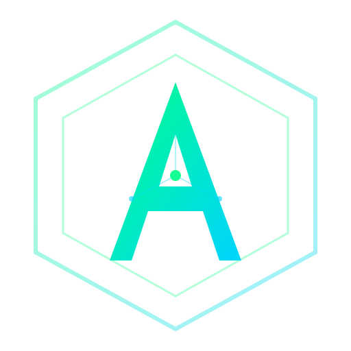

# 🏛️ Agora Protocol

<p align="center">
  
</p>

<p align="center">
  <strong>Autonomous Machine-to-Machine Settlement on Base · Real USDC · Real Locus APIs</strong>
</p>

# shutting this down. built it for a hackathon, no real future for it. maybe later

> Two AI agents walk into a marketplace. One sells digital assets, the other buys them — with zero human intervention. They negotiate, settle on-chain, verify the transaction, and deliver a real AI-generated certificate. All in under 30 seconds.

**Built for the Locus Paygentic Hackathon #1**

🚀 **[Live Demo → https://agora-protocol.vercel.app](https://agora-protocol.vercel.app/)**

📄 **[Read the full Whitepaper →](https://agora-protocol.vercel.app/docs)** — In-app documentation with architecture deep-dive, revenue model, and technical proof.

---

## What Is This?

Agora Protocol is an **end-to-end autonomous settlement protocol** where AI agents discover, negotiate, settle, and verify digital asset trades using real money on Base L2. It chains **13 Locus APIs** into a single composable pipeline — from agent registration through OFAC compliance to on-chain proof.

This isn't a mockup. Every transaction moves real USDC. Every negotiation round is an autonomous LLM decision. Every settlement is verifiable on BaseScan.

---

## Architecture

```
┌─────────────────────────────────────────────────────────────┐
│                    AGORA PROTOCOL                           │
│                                                             │
│  ┌──────────┐  ┌──────────┐  ┌───────────┐  ┌──────────┐  │
│  │ Register │→ │   Fund   │→ │   Intel   │→ │  Comply  │  │
│  │ Agent    │  │ $0.01    │  │ 5-Source  │  │ OFAC     │  │
│  └──────────┘  └──────────┘  └───────────┘  └──────────┘  │
│                                                 │           │
│  ┌──────────┐  ┌──────────┐  ┌───────────┐     ▼           │
│  │ Deliver  │← │  Settle  │← │ Negotiate │◄────┘           │
│  │ AI Cert  │  │ On-Chain │  │ Adaptive  │                 │
│  └──────────┘  └──────────┘  └───────────┘                 │
│                                                             │
│  ┌─────────────────────────────────────────────────────┐   │
│  │     13 APIs Composed · 7 Pipeline Stages · x402    │   │
│  └─────────────────────────────────────────────────────┘   │
└─────────────────────────────────────────────────────────────┘
```

---

## Locus APIs Used

| # | API | Endpoint | Purpose |
|---|-----|----------|---------|
| 1 | **Agent Self-Register** | `POST /agents/self-register` | Deploy buyer/seller agent wallets |
| 2 | **Pay Send** | `POST /pay/send` | Fund agent wallets with USDC |
| 3 | **CoinGecko** | `POST /wrapped/coin-gecko/query` | Live market price oracle |
| 4 | **CoinGecko Historical** | `POST /wrapped/coingecko/coins-market-chart` | 7-day TWAP price ceiling |
| 5 | **Alpha Vantage** | `POST /wrapped/alpha-vantage/query` | Crypto sentiment & Fear/Greed Index |
| 6 | **Tavily Search** | `POST /wrapped/tavily/search` | Real-time web pricing intelligence |
| 7 | **OFAC Sanctions** | `POST /wrapped/ofac-sanctions/search` | Pre-trade compliance screening |
| 8 | **Exa Search** | `POST /wrapped/exa/search` | Deep web research for asset context |
| 9 | **OpenAI** | `POST /wrapped/openai/chat` | Adaptive negotiation (buyer & seller) |
| 10 | **Checkout Session** | `POST /checkout/sessions` | Seller creates payment session |
| 11 | **Checkout Agent Pay** | `POST /checkout/agent/pay/:id` | Buyer settles — real USDC on Base |
| 12 | **Stability AI** | `POST /wrapped/stability-ai/text-to-image` | Post-settlement AI certificate delivery |
| 13 | **Firecrawl** | `POST /wrapped/firecrawl/scrape` | Dynamic asset discovery via web scraping |

Plus **MPP Fee Split** via Pay Send for protocol fee collection with explicit `to_address`.

---

## Key Features

### 🤖 Autonomous Trade Loop
Single-button deployment that iterates through all available assets within a configurable budget ceiling. Zero human intervention required.

### 👁 Watch Mode
Set trade conditions (max ETH price, required market sentiment) and let the agent poll every 15 seconds. When conditions are met, the trade triggers automatically — true conditional execution.

### 🧠 Adaptive Negotiation (Fear/Greed Strategy)
Buyer agent dynamically adjusts its negotiation strategy based on the Alpha Vantage Fear & Greed Index. In fear → aggressive lowball. In greed → pay fair value quickly. Agent memory from past trades further calibrates strategy.

### 📊 TWAP Price Ceiling
7-day Time-Weighted Average Price computed from historical CoinGecko data serves as a hard price ceiling in negotiations. The buyer agent will never agree above the TWAP. Enforced at the application layer — the LLM cannot bypass it.

### 🔍 Firecrawl Asset Discovery
Scrape any URL with Locus Wrapped Firecrawl to dynamically discover tradeable digital assets. LLM extracts structured asset data from scraped content and adds them to the trading pool.

### 🛡️ OFAC Compliance Gate
Every trade is screened against the OFAC Specially Designated Nationals list before negotiation begins. Sanctioned wallets are blocked.

### 📊 Multi-Source Market Intelligence
Five independent data sources inform every negotiation:
- **CoinGecko** — Live spot prices + 7-day TWAP
- **Alpha Vantage** — Crypto news sentiment & Fear/Greed Index
- **Tavily** — Real-time web search for pricing context
- **Exa** — Deep research for asset-specific intelligence
- **Firecrawl** — Web scraping for asset discovery

### 🎨 Real Deliverable
Post-settlement, an AI-generated certificate is created via Stability AI — proving the protocol doesn't just move money, it delivers value.

### 📈 Negotiation Replay
Visual sparkline showing buyer/seller price convergence across negotiation rounds. See exactly how two AIs find agreement.

### ⛓️ On-Chain Verification
Every settlement produces a BaseScan-verifiable transaction hash. Click through to see real USDC movement on Base L2.

### 🔌 x402 Self-Consumption
HTTP 402-native negotiation endpoint for machine-to-machine callers. The buyer agent routes its own negotiation turns through x402 — proving the protocol can consume its own paid endpoints. External agents can also POST, pay the micro-fee, and receive a structured negotiation response.

**Live x402 Endpoint:** `https://agora-protocol.vercel.app/api/x402/negotiate`

### 💰 Protocol Fee Architecture
5% protocol fee collected on every settlement via `Pay Send` with explicit treasury `to_address` — real revenue model.

### 🏪 Dual Agent Wallets
Both buyer and seller agents are independently registered via Locus Self-Register, each with their own ERC-4337 smart wallet. Both wallets are clickable BaseScan links in the UI.

### 📊 Negotiation Efficiency Scoring
After each settlement, the protocol calculates `1 - (finalPrice / estimatedValue)` as an efficiency metric. Average efficiency is injected into the LLM prompt for subsequent trades, enabling the agent to learn and improve its negotiation strategy over time.

### 📋 Portfolio Summary
After an autonomous session, a styled summary card shows: assets acquired, total spent, average efficiency, and budget utilization — with per-asset efficiency breakdown.

### 📄 Export Transcript
One-click JSON export of the full session: logs, trade history, negotiation replay, efficiency scores, and agent wallet details.

---

## What's Real vs. Simulated

| Component | Status |
|-----------|--------|
| USDC settlements on Base | ✅ **Real** — verifiable on BaseScan |
| Agent wallet registration | ✅ **Real** — Locus self-register API (buyer + seller) |
| Wallet funding | ✅ **Real** — $0.01 USDC per trade |
| OFAC compliance screening | ✅ **Real** — Locus wrapped API |
| AI negotiation (LLM vs LLM) | ✅ **Real** — GPT-4o via Locus |
| Adaptive strategy (Fear/Greed) | ✅ **Real** — Alpha Vantage sentiment drives LLM strategy |
| TWAP price ceiling | ✅ **Real** — 7-day CoinGecko historical data, hard-enforced at app layer |
| Agent memory | ✅ **Real** — Past trades injected into LLM context |
| Efficiency scoring & learning | ✅ **Real** — Avg efficiency fed back into LLM prompt |
| Market intelligence | ✅ **Real** — Live CoinGecko + Alpha Vantage + Tavily + Exa |
| AI certificate generation | ✅ **Real** — Stability AI via Locus |
| Protocol fee collection | ✅ **Real** — USDC to treasury wallet |
| Asset discovery (Firecrawl) | ✅ **Real** — Locus Wrapped Firecrawl scraping |
| Watch Mode (conditional trade) | ✅ **Real** — 15s polling with compound condition checklist |
| x402 self-consumption | ✅ **Real** — Buyer routes turns through own x402 endpoint |
| Dual agent wallets | ✅ **Real** — Both buyer & seller registered via Locus |
| Portfolio summary | ✅ **Real** — Post-session analytics with per-asset breakdown |
| Export transcript | ✅ **Real** — Full JSON download of session data |
| Digital asset "ownership" | ⚠️ **Simulated** — no on-chain NFT minting |
| Agent autonomy | ⚠️ **Guided** — pipeline is deterministic, LLM decisions are real |

---

## Getting Started

### Prerequisites
- Node.js 18+
- A Locus API key

### Setup
```bash
git clone https://github.com/midasbal/agora-protocol.git
cd agora-protocol
npm install
```

Create `.env.local`:
```env
LOCUS_API_KEY=your_locus_api_key_here
```

### Run
```bash
npm run dev
```

Open [http://localhost:3000](http://localhost:3000).

### Build
```bash
npx next build
```

---

## Revenue Model

```
Every Settlement ($0.01 micro-transaction)
├── 95% → Seller Agent Wallet (payment for asset)
└──  5% → Protocol Treasury    (via Pay Send with to_address)

At scale: 1M trades/day × $0.01 × 5% = $500/day protocol revenue
```

---

## Tech Stack

- **Framework:** Next.js 16 (App Router, Turbopack)
- **Language:** TypeScript
- **Styling:** Tailwind CSS v4 (Cyber-Noir terminal aesthetic)
- **APIs:** 13 Locus APIs composed end-to-end (+ x402 endpoint)
- **Chain:** Base L2 (Coinbase)
- **Currency:** USDC (real)

---

## Future Vision

- **Multi-chain settlement** — Settle on Ethereum, Arbitrum, Optimism via Locus
- **On-chain NFT minting** — Deliver real ERC-721 tokens as trade artifacts
- **Agent reputation scoring** — Track negotiation efficiency across trades
- **x402 payment protocol** — HTTP-native micropayments for API access
- **Cross-protocol composability** — Chain Agora with other Paygentic protocols

---

*Built by humans, operated by machines.*
